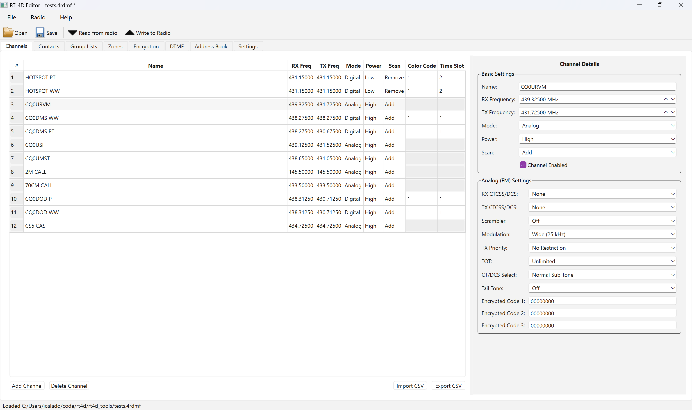

# RT4D Tools

Utility scripts and GUI for exploring, editing, and flashing RT-4D radio codeplug files.

> [!CAUTION]
> This software is NOT compatible with FW >= 3.18.

> [!WARNING]
> This project is pre-release beta software; expect rough edges and verify programming steps on a non-critical radio first.

## Getting Started
- Ensure Python 3.9+ is installed.
- Install dependencies: `pip install -r requirements.txt`

## GUI
Run `python3 rt4d_gui.py` to launch the PySide6 editor for interactive channel/contact management.

## Command-Line Workflow
1. Parse an existing codeplug: `python3 rt4d_editor.py --file tests.4rdmf --list-channels`
2. Export channels to CSV: `python3 rt4d_editor.py --file your.4rdmf --export-csv channels.csv`
3. Backup over UART: `python3 rt4d_editor.py --port COM3 --backup backup.bin`
4. Flash changes: `python3 rt4d_editor.py --port COM3 --flash your.4rdmf --flash-regions channels contacts`

## Screenshots

## Development
- Test deps (pytest) for the automated suite: `pip install -r requirements-dev.txt` *(add if you maintain one)*
- Unit tests (parser/serializer/models/uart): `python3 -m pytest tests -q`
- Existing legacy scripts in the repo print to stdout; the new suite uses asserts.
- 
## Fixtures
- `tests.4rdmf`should be a golden dump from a live radio used for parser/serializer regressions.
